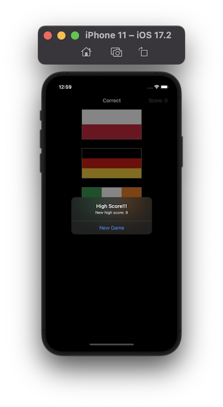

# Project 2 - Guess the Flag

https://www.hackingwithswift.com/100/19

## Topics
UIButton, CALayer, UIColor, Random Numbers, IBActions, UIAlertController

## [Challenges](https://www.hackingwithswift.com/read/2/6/wrap-up):
1. Try showing the player’s score in the navigation bar, alongside the flag to guess.
2. Keep track of how many questions have been asked, and show one final alert controller after they have answered 10. This should show their final score.
3. When someone chooses the wrong flag, tell them their mistake in your alert message – something like “Wrong! That’s the flag of France,” for example.

## Screenshots

