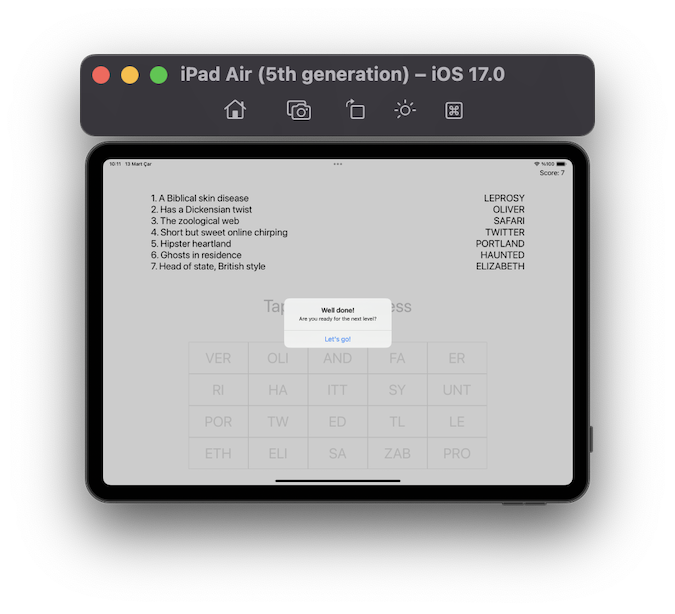

# Project 9 - Grand Central Dispatch

https://www.hackingwithswift.com/100/39

## Topics
Grand Central Dispatch, Quality of Service Queues(QoS), performSelector()

## [Challenges](https://www.hackingwithswift.com/read/9/6/wrap-up):
1. Modify project 1 so that loading the list of NSSL images from our bundle happens in the background. Make sure you call reloadData() on the table view once loading has finished!
2. Modify project 8 so that loading and parsing a level takes place in the background. Once you’re done, make sure you update the UI on the main thread!
3. Modify project 7 so that your filtering code takes place in the background. This filtering code was added in one of the challenges for the project, so hopefully you didn’t skip it!

## Screenshots

