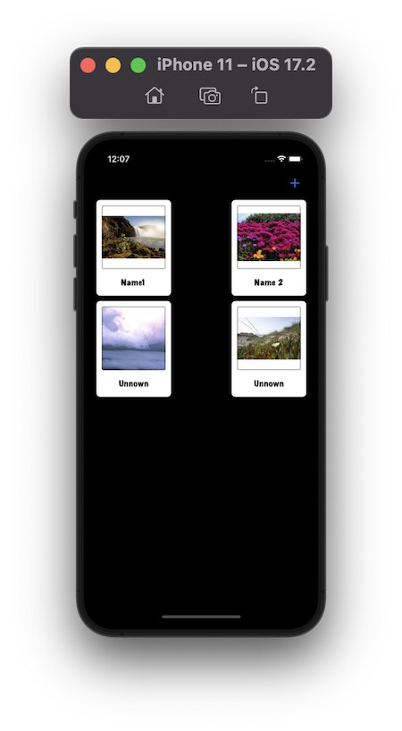
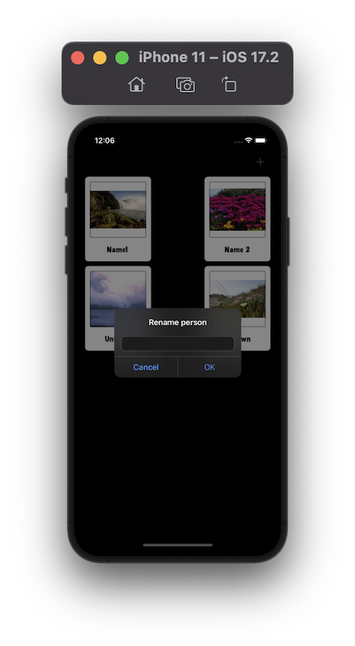

# Project 12 - User Defaults

https://www.hackingwithswift.com/100/48

## Topics
UserDefaults, NSCoding, Codable

## [Challenges](https://www.hackingwithswift.com/read/12/5/wrap-up):
1. Modify project 1 so that it remembers how many times each storm image was shown – you don’t need to show it anywhere, but you’re welcome to try modifying your original copy of project 1 to show the view count as a subtitle below each image name in the table view.
2. Modify project 2 so that it saves the player’s highest score, and shows a special message if their new score beat the previous high score.
3. Modify project 5 so that it saves the current word and all the player’s entries to UserDefaults, then loads them back when the app launches.

## Screenshots

