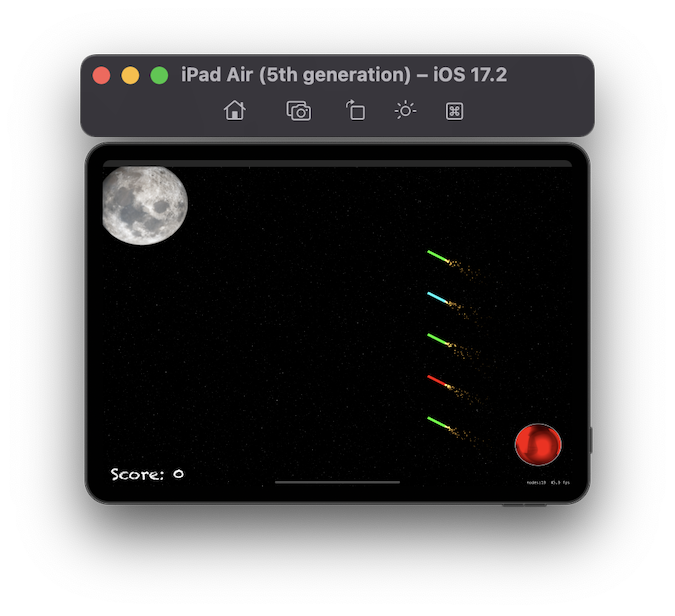

# Project 20 - Fireworks Night

https://www.hackingwithswift.com/100/70

## Topics
UIBezierPath, SKAction.follow(), for case let, Color Blending, Shake Gesture

## [Challenges](https://www.hackingwithswift.com/read/20/5/wrap-up):
1. For an easy challenge try adding a score label that updates as the player’s score changes.
2. Make the game end after a certain number of launches. You will need to use the invalidate() method of Timer to stop it from repeating.
3. Use the waitForDuration and removeFromParent actions in a sequence to make sure explosion particle emitters are removed from the game scene when they are finished.

## Screenshots

