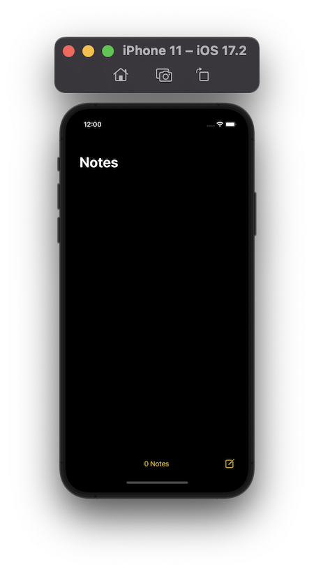
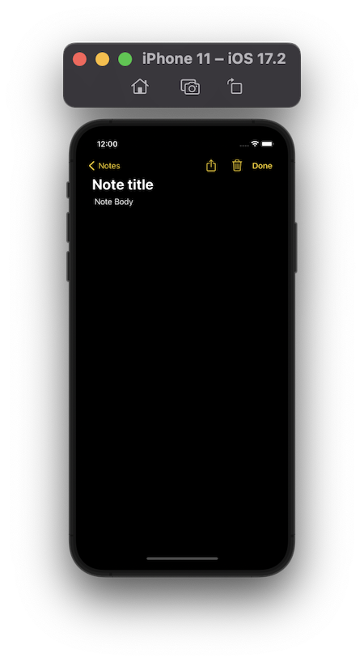
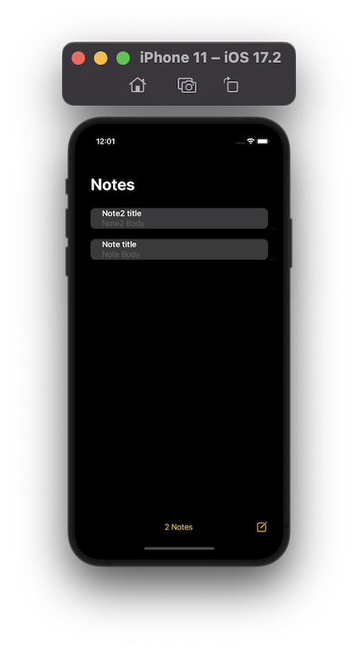

# Milestone:Projects 19-21 - Notes

https://www.hackingwithswift.com/100/74

## [Challenge](https://www.hackingwithswift.com/guide/8/3/challenge):
Have you ever heard the phrase, “imitation is the highest form of flattery”? I can’t think of anywhere it’s more true than on iOS: Apple sets an extremely high standard for apps, and encourages us all to follow suit by releasing a vast collection of powerful, flexible APIs to work with.

Your challenge for this milestone is to use those API to imitate Apple as closely as you can: I’d like you to recreate the iOS Notes app. I suggest you follow the iPhone version, because it’s fairly simple: a navigation controller, a table view controller, and a detail view controller with a full-screen text view.

How much of the app you imitate is down to you, but I suggest you work through this list:

1. Create a table view controller that lists notes. Place it inside a navigation controller. (Project 1)
2. Tapping on a note should slide in a detail view controller that contains a full-screen text view. (Project 19)
3. Notes should be loaded and saved using Codable. You can use UserDefaults if you want, or write to a file. (Project 12)
4. Add some toolbar items to the detail view controller – “delete” and “compose” seem like good choices. (Project 4)
5. Add an action button to the navigation bar in the detail view controller that shares the text using UIActivityViewController. (Project 3)

Once you’ve done those, try using Interface Builder to customize the UI – how close can you make it look like Notes?

Note: the official Apple Notes app supports rich text input and media; don’t worry about that, focus on plain text.

Go ahead and try now. Remember: don’t fret if it sounds hard – it’s supposed to stretch you.

Here are some hints in case you hit a problem:

- You could represent each note using a custom Note class if you wanted, but to begin with perhaps just make each note a string that gets stored in a notes array.
- If you do intend to go down the custom class route for notes, make sure you conform to Codable – you might need to re-read project 12.
- Make sure you use NotificationCenter to update the insets for your detail text view when the keyboard is shown or hidden.
- Try changing the tintColor property in Interface Builder. This controls the color of icons in the navigation bar and toolbar, amongst other things.

## Screenshots

