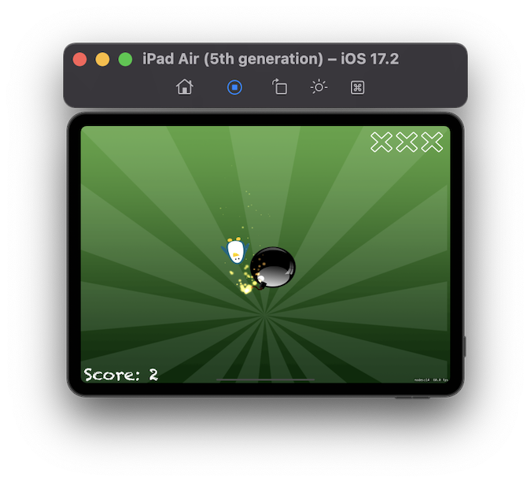
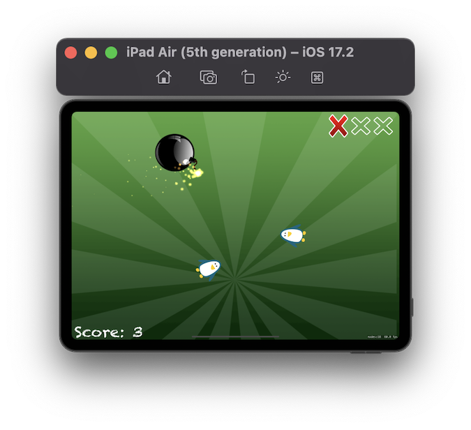
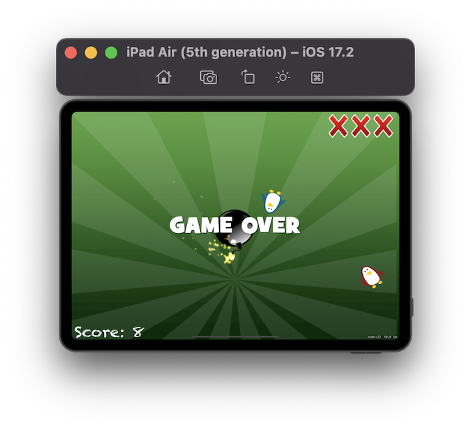

# Project 23 - Swifty Ninja

https://www.hackingwithswift.com/100/77

## Topics
SKShapeNode, touchesEnded(), AVAudioPlayer, Physics Speed, CaseIterable, removeFirst(), Action Groups

## [Challenges](https://www.hackingwithswift.com/read/23/8/wrap-up):
1. Try removing the magic numbers in the createEnemy() method. Instead, define them as constant properties of your class, giving them useful names.
2. Create a new, fast-moving type of enemy that awards the player bonus points if they hit it.
3. Add a “Game over” sprite node to the game scene when the player loses all their lives.

## Screenshots

