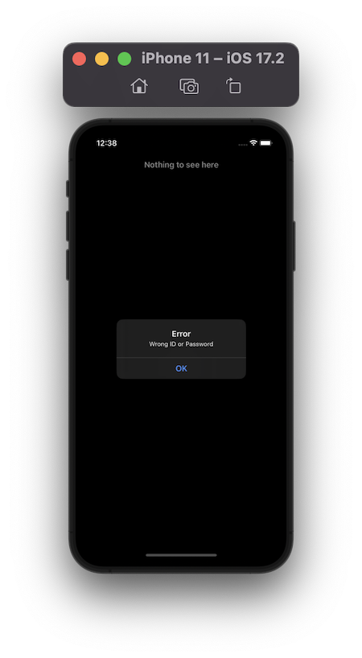
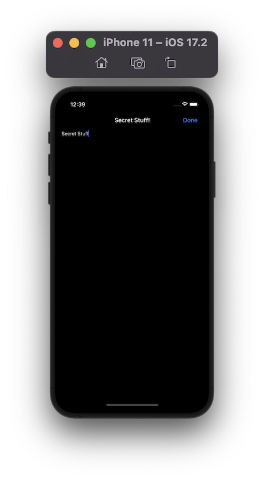

# Project 28 - Secret Swift

https://www.hackingwithswift.com/100/93

## Topics
LocalAuthentication, iOS keychain, Biometric Authentication, UITextView

## [Challenges](https://www.hackingwithswift.com/read/28/5/wrap-up):
1. Add a Done button as a navigation bar item that causes the app to re-lock immediately rather than waiting for the user to quit. This should only be shown when the app is unlocked.
2. Create a password system for your app so that the Touch ID/Face ID fallback is more useful. You'll need to use an alert controller with a text field like we did in project 5, and I suggest you save the password in the keychain!
3. Go back to project 10 (Names to Faces) and add biometric authentication so the user’s pictures are shown only when they have unlocked the app. You’ll need to give some thought to how you can hide the pictures – perhaps leave the array empty until they are authenticated?

## Screenshots

