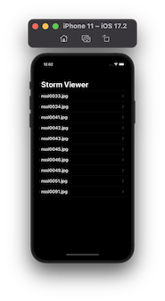
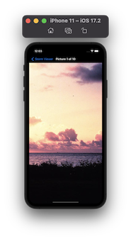
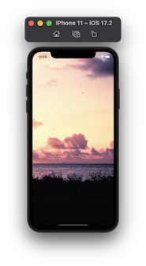

# 100DaysOfSwift
This is my code from all the projects in my 100 Days Of Swift

# Preview
| Project/Topic | Screenshots |
| --------------|------------ |
| [Project1](https://github.com/AybarsBal/100DaysOfSwift/tree/master/01-Project1%20-%20Storm%20Viewer) - Storm Viewer   View Controllers, Storyboards, File Manager |    |
|||
